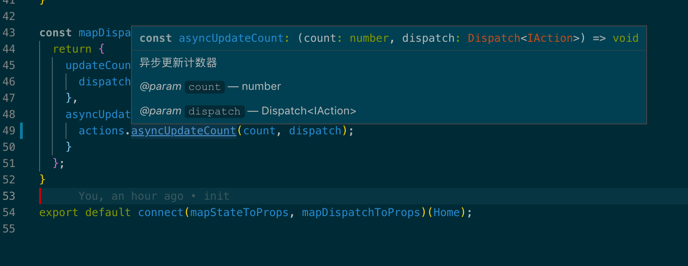
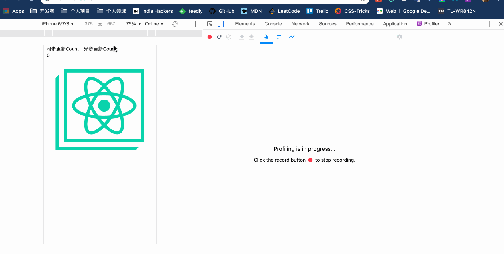
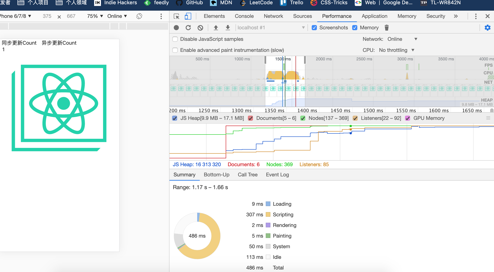

# typescript-react-starter


`typescript-react-starter` 是一个使用CRA编写的 TypeScript Starter 工程，集成了 [ React + React-Router + Redux + Redux-Thunk ]，旨在为移动 Web 应用开发者提供 “开箱即用” 的 TypeScript 工程，开发者只需下载此项目，根据范例即可编写复杂大型的 React 应用。

## Install

```bash
$ git clone git@github.com:icepy/typescript-react-starter.git
$ cd typescript-react-starter
$ yarn
$ npm start
```

使用浏览器访问 `http://localhost:3000/`。（更多命令可查看 package.json 的 scripts 字段）

## 工程结构

- assets 放置图片等文件资源
- components 放置被共享的组件
- pages 放置页面级别的组件
- services 放置本工程依赖的所有请求服务
- store 放置本工程被管理的数据流
- themes 放置本工程主题文件
- third_party 放置依赖的第三方
- typings 放置类型增强
- utils 工具函数集合
- App.tsx 应用的容器文件
- index.tsx 入口文件

## 函数式编程

函数式的好处，非常多，举例不拘。不管是样式还是组件逻辑，我们只有一个原则：组合，我们需要从这样的角度来考虑任何问题。

## 适配方案

基于iPhone 6来完成设计稿，即 1334 * 750，在编写的时候直接使用 `px` 单位即可。

## 必要的注释




## 时间旅行&操作日志

操作的回溯让我们对某一个业务的变化了如指掌


## Component

节点可以打上 tag 或 name，方便于任何一个人来理解业务


## Profiler

> 优化是另一个问题，我们会基于此来展开优化，包括网络，资源文件，store 的大小，react 组合，分割等等方面。





## 远程回溯

> 这个事情就能做一个大系统

当用户端发生一个错误时，我们可以将当前节点的数据快照传输到服务端，然后进行错误分析。

## CI/CD

> 我之前一直使用的是gitlab，所以CI/CD是基于 runner 做的。

## LICENSE

GNU LESSER GENERAL PUBLIC LICENSE Version 3, 29 June 2007
